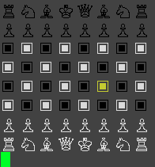

# Ruby Chess
***
*A game by [Chris B](http://www.motomorphosis-ind.com)*
Ruby Chess (in development) is a chess game written in the Ruby language meant to be played by 1 human against a computer opponent.
When choosing its next move, the computer uses [depth-first search](https://en.wikipedia.org/wiki/Depth-first_search) to find the shortest path to victory.
Good luck!
***
## To Play
* download or clone master branch of repo
### Prerequisites
* requires [Ruby](https://www.ruby-lang.org/en/downloads/)
* board and pieces are black and white, so game looks best with a different color terminal background
***
* CD into top-level directory
* run `ruby 'display.rb'` from terminal

* Use arrow keys to move cursor, select piece to move with Enter
* Available moves will be highlighted in red
* Select desired destination square & press Enter to move OR
* Select piece with cursor & press Enter again to cancel (to choose another piece to move)
***
